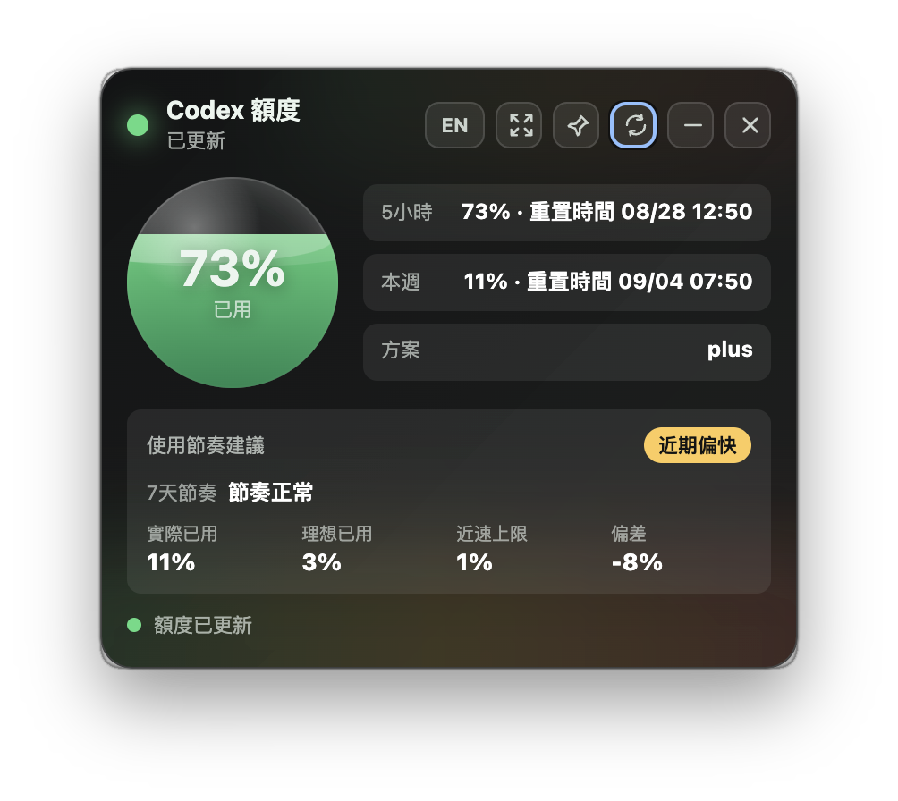
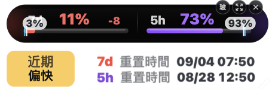

# Claude 額度 & Codex 額度 for macOS

兩款專為 **macOS** 打造的用量桌面小工具，以繁體中文顯示 **5 小時**與 **7 天**用量、重置時間及使用節奏。
它們是**兩個各自獨立的 App**，共用同一份 UI／HUD／節奏判斷邏輯，因此放在同一個 repo 維護。

| App | 看什麼 | 資料來源 | 安裝後名稱 |
|---|---|---|---|
| **Claude 額度** | Claude Code 用量 | 本機 statusLine hook，或登入 claude.ai 讀帳號級別用量 | `/Applications/Claude 額度.app` |
| **Codex 額度** | Codex CLI 用量 | 本機 `~/.codex` + Codex CLI | `/Applications/Codex 額度.app` |

> [!IMPORTANT]
> **這兩個 App 還沒有 Apple 公證（notarization）**，所以第一次開啟會被 Gatekeeper 擋下來，
> 顯示「無法打開，因為 Apple 無法檢查其是否包含惡意軟體」。
> 本魯蛇還沒買 Apple 開發者帳號，不過很快應該就會買了 哈哈 🙃
>
> 在那之前，用下面任一種方式打開就好（只需要做一次）：
>
> **方法 A：右鍵打開**
> 在 `/Applications` 裡對 App 圖示按**右鍵 → 打開**，跳出的對話框再按一次「打開」。
> （直接雙擊不行，一定要走右鍵選單。）
>
> **方法 B：清掉隔離屬性**
> ```bash
> xattr -cr "/Applications/Claude 額度.app"
> xattr -cr "/Applications/Codex 額度.app"
> ```
>
> 兩個 App 都是 ad-hoc 簽章（`codesign -dv` 會顯示 `Signature=adhoc`），程式碼全部公開在這個 repo 裡，可以自行檢視或自行建置。

---

## 用 .dmg 安裝

到 [Releases](https://github.com/michelle0812/claude-codex-quota-mac/releases) 下載對應你 Mac 的檔案：

| 你的 Mac | 選這個 |
|---|---|
| Apple Silicon（M1／M2／M3／M4，2020 年底之後） | `*-arm64.dmg` |
| Intel（2020 年以前的機型） | `*-x64.dmg` |

不確定的話：左上角  → 「關於這台 Mac」，看「晶片／處理器」那一行寫 Apple 還是 Intel。

安裝步驟：

1. 雙擊 `.dmg` 掛載。
2. 把 App 拖進 `Applications`。
3. **第一次開啟請照上面的 Gatekeeper 說明用右鍵打開**，之後就能正常雙擊。

`.zip` 是給需要自動更新流程或自行部署的人用的，一般使用者用 `.dmg` 就好。

---

## 功能特色

兩個 App 共通：

- 繁體中文介面
- 5 小時與 7 天用量進度
- 緊湊 HUD 與頂端吸附細條顯示
- 使用節奏建議與近期速度提醒
- 可調整提醒動畫與用量重新整理間隔（1–30 分鐘）
- 可切換 Dock 圖示是否顯示
- 視窗置頂
- **沒有選單列圖示**，所有控制都在 widget 視窗本身

Claude 額度額外提供：

- 可選：登入 claude.ai，改讀帳號級別用量（不受哪台機器在跑 Claude Code 影響）

## 畫面

<p align="center">
  
</p>

<p align="center">
  
</p>

---

## Claude 額度：運作方式

### 資料來源一：本機 statusLine hook（預設）

Claude Code 沒有公開的本機用量查詢指令，但每次刷新 statusLine 時，它會把當前 session 的完整 JSON（含 `rate_limits.five_hour` / `rate_limits.seven_day` 的 `used_percentage` 與 `resets_at`）從 stdin 傳給 statusLine hook。

`apps/claude/scripts/usage-statusline.py` 就是一個 hook：它**不輸出任何 statusLine 文字**，只把收到的 JSON 原子寫入 `~/.claude/usage-status.json`。widget 主程序再反向讀這個檔，取出兩個用量視窗呈現到桌面。

```
Claude Code ──stdin JSON──▶ usage-statusline.py ──▶ ~/.claude/usage-status.json ──▶ widget
```

#### 安裝 statusLine hook

1. 複製 hook script 到 Claude Code 設定目錄：

   ```bash
   cp apps/claude/scripts/usage-statusline.py ~/.claude/usage-statusline.py
   ```

2. 在 `~/.claude/settings.json` 加入 `statusLine`（把 python3 路徑換成 `which python3` 的結果）：

   ```json
   {
     "statusLine": {
       "type": "command",
       "command": "/usr/bin/python3 /Users/<你的帳號>/.claude/usage-statusline.py"
     }
   }
   ```

   > 若你已有自訂 statusLine，請改成先呼叫原本的 script、再 `tee` 一份給這個 hook，或把落地邏輯併進你的 script。

3. 開一個 Claude Code session 跑一次對話，確認 `~/.claude/usage-status.json` 有被寫入且 `rate_limits` 區塊存在。

環境變數 `CLAUDE_USAGE_STATUS_FILE` 可覆寫預設讀取路徑（方便測試）。

### 資料來源二：claude.ai 帳號用量（可選）

在「設定」視窗點「登入 claude.ai」，會開一個獨立視窗讓你正常登入。登入後 widget 會攔下 `sessionKey` cookie（以 macOS `safeStorage` 加密後存於使用者資料夾），並用隱藏視窗呼叫 `https://claude.ai/api/organizations/<org>/usage` 取得帳號級別的 5 小時 / 7 天用量。

此來源與哪台機器在跑 Claude Code 無關，適合裝在沒有本機 statusLine 資料的機器上。

**優先序**：登入 claude.ai 後以其為主；未登入或抓取失敗（含 Cloudflare 擋下、登入失效）時自動退回本機 `usage-status.json`。`claude.ai/api/...` 為非公開介面，Anthropic 改版即可能失效。

## Codex 額度：運作方式

直接讀本機 `~/.codex` 並呼叫 Codex CLI 取得用量，不需要安裝任何 hook。

---

## 系統需求

- macOS
- Claude 額度：已安裝並登入 Claude Code，且 `python3` 可用（系統內建即可）；或改用 claude.ai 登入
- Codex 額度：已安裝並登入 OpenAI Codex CLI
- Node.js 與 npm（僅本機開發或自行建置時需要）

## 基本操作

- 標題列按鈕：語言、緊湊／展開、置頂、重新整理、**設定（齒輪）**、隱藏、退出。
- 緊湊 HUD：滑鼠移上去展開控制列。
- 將 HUD 拖到螢幕頂端，可切換為頂端細條模式。
- **隱藏**後，點 Dock 圖示即可重新叫出視窗；**退出（紅色 ✕）**才是真正關閉程式。
- 「設定」視窗可調整提醒動畫、用量重新整理間隔（1–30 分鐘）與 Dock 圖示顯示；Claude 版另可登入／登出 claude.ai 切換資料來源。按「儲存」後會自動關閉設定視窗。

---

## 排錯：Electron 只裝了一個空殼

如果 `npm start` 或 `npm run build` 出現 `Electron failed to install correctly`，
或是 App 打包出來明顯壞掉，先檢查 Electron 的實際大小：

```bash
du -sh apps/claude/node_modules/electron/dist   # 正常應該是 200MB 以上
```

如果只有幾百 KB，代表 electron 的 postinstall 解壓失敗了（在某些 macOS 環境下
它會「成功結束」卻只解出兩三個檔案，不會報錯）。修法是直接用 macOS 原生的
`ditto` 從快取重解一次：

```bash
cd apps/claude/node_modules/electron
rm -rf dist && mkdir dist
ditto -x -k "$HOME/Library/Caches/electron/electron-v31.7.7-darwin-arm64.zip" dist
printf 'Electron.app/Contents/MacOS/Electron' > path.txt
```

（`apps/codex` 同樣做一次。快取裡沒有 zip 的話，先跑一次 `npm install` 讓它下載。）

---

## 專案結構

```
claude-codex-quota-mac/
├── packages/
│   ├── shared/                 ← 共用程式碼的唯一版本（會被複製到各 app）
│   │   ├── main-core.js        ← 主行程核心：視窗、IPC、設定儲存
│   │   ├── preload-core.js     ← contextBridge 橋接（window.quotaBridge）
│   │   ├── renderer-core.js    ← HUD／細條的全部畫面邏輯
│   │   ├── settings-core.js    ← 設定視窗邏輯
│   │   ├── renderer.html / settings.html
│   │   ├── styles.css / settings.css
│   │   ├── pace-advice.js      ← 使用節奏判斷
│   │   ├── quota-store.js      ← 快取、歷史、重新整理排程
│   │   └── dock-visibility.js、widget-settings.js、compact-layout.js
│   └── build-scripts/          ← 兩個 app 共用的建置／測試腳本
│       ├── after-pack-macos.js ← ad-hoc 簽章
│       ├── verify-widget-settings.js
│       └── verify-app-config.js
├── scripts/sync-shared.js      ← 把 packages/shared/ 複製到各 app 的 src/shared-gen/
└── apps/
    ├── claude/                 ← Claude 額度（獨立 package.json / Electron app）
    │   ├── src/app-config.js   ← 這個 app 的名稱、主色、文案、帳號區塊設定
    │   └── src/main/           ← main.js（薄殼）、preload.js（薄殼）、
    │                              quota-service.js、claude-ai-service.js（各自獨立）
    └── codex/                  ← Codex 額度（結構相同，沒有 claude-ai-service.js）
```

### 共用模組怎麼運作

`packages/shared/` 是共用程式碼的**唯一版本**。各 app 的 `npm install` / `npm start` /
`npm test` / `npm run build` 之前，`scripts/sync-shared.js` 會把 `.js` / `.css` / `.html`
全部複製到 `apps/<app>/src/shared-gen/`，程式再從那裡 `require` 或用 `<script>` 載入。

`apps/*/src/shared-gen/` 已列入 `.gitignore`，是產生物、不要手改——**改共用邏輯請改 `packages/shared/`**。

之所以用「複製」而不是 npm workspaces symlink：electron-builder 的 `files` 解析對 workspace symlink 很容易出錯，
複製之後 electron-builder 看到的就只是 `src/` 底下的一般檔案，打包零風險。

### 兩個 App 的差異都放在哪裡

只有三個地方：

| 檔案 | 放什麼 |
|---|---|
| `apps/<app>/src/app-config.js` | 顯示名稱、mini bar／HUD 主色、文案覆蓋、有沒有帳號登入區塊 |
| `apps/<app>/src/main/main.js` | 組出 config 傳給 `main-core.js`：圖示路徑、`readQuota`、`auth` |
| `apps/<app>/src/main/quota-service.js` | 真正去讀額度的方式（Claude 讀檔／API，Codex 跑 CLI） |

主色由 `app-config.js` 的 `accent` 定義，`renderer-core.js` 開場就把它灌進 CSS 變數
（`--app-weekly` / `--app-short` 等），HUD、玻璃球與頂端細條 mini bar 都吃同一組 token，
所以兩個 App 從哪個模式看都一眼分得出來（Claude 水藍、Codex 綠）。
`npm test` 裡的 `verify-app-config.js` 會擋住「兩個 App 主色設成一樣」這種回歸。

`quota-store.js` 需要的 `readQuota` 由呼叫端注入——因為 `quota-service.js` 是兩個 App 各自不同的
（Claude 讀 `usage-status.json` / claude.ai，Codex 跑 Codex CLI），共用模組不綁死其中任何一邊。

## 開發

```bash
npm run install:all        # 兩個 app 各自 npm install

npm run start:claude       # 跑 Claude 額度
npm run start:codex        # 跑 Codex 額度

npm run test:all           # 兩邊的驗證腳本都跑
npm run test:claude
npm run test:codex
```

## 建置

```bash
npm run build:all          # 產出四個 .dmg + 四個 .zip
npm run build:claude
npm run build:codex
```

產物在 `apps/<app>/dist/`：

| 檔案 | 對應 |
|---|---|
| `ClaudeQuota-<版本>-macOS-arm64.dmg` | Claude 額度，Apple Silicon |
| `ClaudeQuota-<版本>-macOS-x64.dmg` | Claude 額度，Intel |
| `CodexQuota-<版本>-macOS-arm64.dmg` | Codex 額度，Apple Silicon |
| `CodexQuota-<版本>-macOS-x64.dmg` | Codex 額度，Intel |

> [!NOTE]
> arm64 與 x64 是**分開序列建置**的（`build:arm64 && build:x64`）。
> 兩個架構的 dmg 若併行建置，兩個 `hdiutil resize` 會互搶資源而失敗（`Exit code: 35`）。

建置不做 Apple Developer ID 簽章或公證，一律 ad-hoc 簽章。

## 已知限制

- Claude 版本機來源的新鮮度取決於 statusLine 多久刷新一次；若超過 20 分鐘沒有新的 session 活動，widget 會顯示「資料過期」提示。
- `used_percentage` 與 `resets_at` 由 Claude Code / Codex CLI 提供，widget 不另行推算絕對 token 數。
- claude.ai 資料來源使用非公開的 `claude.ai/api/organizations/<org>/usage`，Anthropic 改版或 Cloudflare 政策調整都可能使其失效；失效時會自動退回本機來源並提示重新登入。
- 僅支援 macOS，已移除 Windows 11 的建置與發行支援。需要 Windows 版請前往 [stupdada/codex-quota-widget](https://github.com/stupdada/codex-quota-widget)。

## 專案來源與致謝

Codex 額度的 macOS 版本修改自 [stupdada/codex-quota-widget](https://github.com/stupdada/codex-quota-widget)，
再上游為 [xicunwus2025-sys/codex-led-widget](https://github.com/xicunwus2025-sys/codex-led-widget)。
Claude 額度的 UI／HUD／節奏判斷再改寫自 Codex 額度，差異在於資料來源。

相關設計與歷史沿革請直接參閱上述原始專案；本 README 不重製其完整圖片與說明。

## 授權

MIT License。衍生內容仍依原專案授權條款使用。
